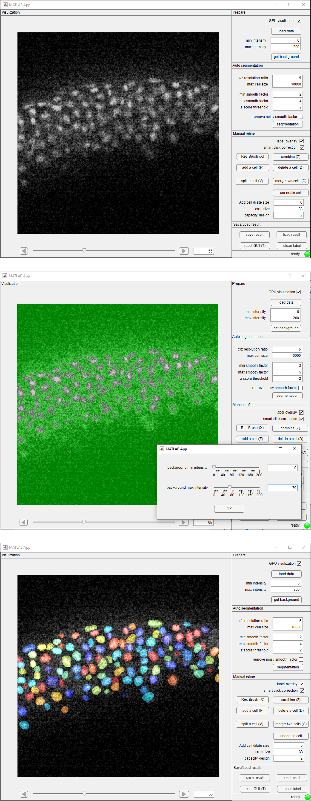

# PrinCut-Auto
An unsupervised automatic 3D cell detector and manual annotation assistant

## Introduction
PrinCut auto is a toolbox providing both an unsupervised automatic 3D cell detector and a GUI for manual annotation. 

A GPU is required for fast Multi-Scale Principal curvature calculation. A standalone GUI is provided, but to use the code for a more flexible analysis, MATLAB 2023a or a later version is required.

## GUI Usage
**Load data**: PrinCut-Auto accepts tif format data.
  
3. Get a rough background by global thresholding (optional)

