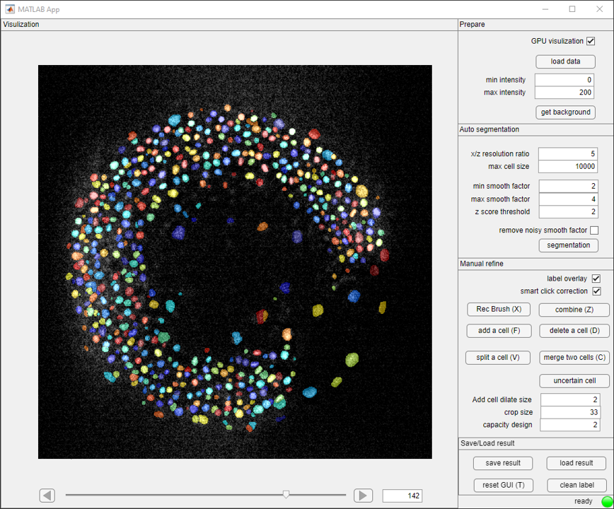
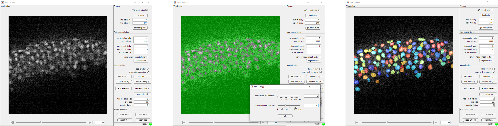

# Welcome to PrinCut-Auto

PrinCut-Auto (multi-scale **Prin**cipal Curvature and Min-**Cut** optimization based **Auto**matic cell detection tool) serves as software providing both unsupervised 3D cell detection and manual detection refinement.

 

## Advantage:

- Robust to noisy data
- Robust to crowded data
- Sensitive to inter-cellular gaps in different scales
- Manually add, delete, split, or merge 3D cell labels by merely clicking

## Usage

### Automatic 3D cell detection

Disable the "GPU visualization" option if your computer has limited GPU memory (> Pixel number * 4 * 10^-8 GB memory required).  Save your data in tif format data and click the *load data* button to read it. After loading the data, Adjust the *min intensity* and *max intensity* to adjust the contrast of the data. Select the figure and use the scroll wheel to zoom in and out, drag the figure to move in x and y directions, and use the bar at the bottom of the figure to move along z direction.

[Optional] Click the *get background* and select a rough background by global thresholding. The selected background will shown in green in GUI. The method is based on null hypothesis testing, enough background pixels without intensity truncation or saturation can significantly improve its accuracy.

Adjust the *x/z resolution*. For example, if your x resolution is 1 um/pixel while z resolution is 5 um/pixel, then *x/z resolution* should be 5. The *min smooth factor* and *max smooth factor* are the STD of the Gaussian smooth filter by pixel. Let the *min smooth factor* be about half of your smallest inter-cellular gap size and the *max smooth factor* be about half of your smallest cell size. Increasing the *z score threshold* value can detect fewer inter-cellular gaps and decrease the over-segmentation rate, and vice versa. Click the *segmentation* button and wait for the lamp at the right bottom corner to turn back to green.

 

### Manual annotation assistance

Add, delete, split, or merge 3D cells by clicking:

https://github.com/yu-lab-vt/PrinCut-Auto/assets/45985407/4b5b38e8-0ed2-4494-a5df-c744179cb331

Keyboard short cut is available for convenience: *F* for *add a cell*, *D* for *delete a cell*, *V* for *split a cell*, *C* for *Merge two cells*, *W* for enable/disable overlay, *Q* and *E* for move along z-axis, *T* for randomly changing color for all labels.

## Why it works

PrinCut-Auto use a statistic-based multi-scale principal curvature (MSPC) to identify the cell seeds, addressing the issue that traditional features like intensity contrast, gradient, or curvature struggle to robustly identify gaps between closely situated cells within noisy backgrounds. MSPC has a capability that matches or potentially surpasses human-level accuracy in detecting inter-cellular gaps in noisy data.

The right figure is a simulated experiment to compare the single-scale principal curvature with MSPC. (a) Simulated data with noise. The data shows 70 pairs of cells in proximity to each other. The cells are arranged from left to right in order of decreasing intensity, while from top to bottom, the cells and inter-cell gaps diminish in size. (b) The signal of simulated data (c) Single-Scale Principal Curvature with Gaussian Smoothing (STD = 3). (d) Threshold on Single-Scale Principal Curvature ($z \geq 2$), 27 pairs of cells are correctly detected. (e) MSPC result (f) Threshold on MSPC ($z \geq 2$), 40 pairs of cells are correctly detected.

The pixels with MSPC larger than the value of *z score threshold* are considered as boundaries or gaps of the cell and the region enveloped by boundaries is considered as cell seeds, which is the central region of potential cells. Then we use the min-cut algorithm to grow a cell seed to its boundary. The min-cut algorithm will find a cut between the current cell seed and the rest cell seeds that maximizes the principal curvature while minimizing the length, and the pixels within the cut are considered as the corresponding cell label of the current cell seed. After growing all seeds to labels, we use hypothesis testing to remove false positives with low-intensity contrast. Lastly, manual refinement is offered as an optional step to enhance the detection results. PrinCut will crop a sub-image, whose size is based on *crop size*, to generate a min-cut network, and use the pixel the user clicked as the source of the network to grow a new detection.

## Requirement

The standalone App is run and tested on the Windows system. The Matlab App is run and tested on Matlab 2023a for both Windows and Ubuntu Systems.

A GPU is required for faster feature calculation. 

To use the code for a faster and more flexible analysis, MATLAB 2023a or a later version is required.

## Citation
If you find the code useful for your research, please cite our paper.

*TBA*
